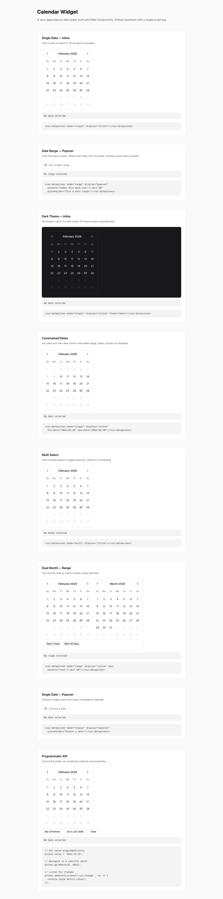

# CalKit

Vanilla JS web component library for date pickers, time pickers, booking calendars, and resource schedulers. Zero dependencies. Shadow DOM encapsulated. Themeable.

<!--  -->

## Install

### CDN (`<script>` tag)

```html
<script src="https://cdn.jsdelivr.net/npm/calkit/dist/calkit.umd.js"></script>
```

All four components are registered automatically. No imports needed.

### Bundler (Vite, Webpack, etc.)

```js
import { CalDatepicker, CalBooking, CalTimepicker, CalScheduler } from 'calkit';
```

Uses the ES module builds from `node_modules`.

### Individual Bundles

Load only the components you need:

| Bundle | CDN (`<script>`) | ES Module (bundler) | Gzipped |
|--------|------------------|---------------------|---------|
| **Full** (all 4) | `calkit.umd.js` (148 KB) | `calkit.es.js` (176 KB) | ~34 KB |
| **Datepicker** only | `datepicker.umd.js` (48 KB) | `datepicker.es.js` (56 KB) | ~12 KB |
| **Timepicker** only | `timepicker.umd.js` (32 KB) | `timepicker.es.js` (36 KB) | ~8 KB |
| **Booking** only | `booking.umd.js` (56 KB) | `booking.es.js` (64 KB) | ~14 KB |
| **Scheduler** only | `scheduler.umd.js` (88 KB) | `scheduler.es.js` (104 KB) | ~21 KB |

---

## Quick Start

### Datepicker

```html
<cal-datepicker mode="single" theme="light"></cal-datepicker>

<script>
  const picker = document.querySelector('cal-datepicker');
  picker.addEventListener('cal:change', (e) => {
    console.log('Selected:', e.detail.value); // "2026-03-15"
  });
</script>
```

### Timepicker

```html
<cal-timepicker start-time="09:00" end-time="17:00" interval="30" format="12h"></cal-timepicker>

<script>
  const tp = document.querySelector('cal-timepicker');
  tp.addEventListener('cal:time-change', (e) => {
    console.log('Selected:', e.detail.value); // "14:30"
  });
</script>
```

### Booking Calendar

```html
<cal-booking theme="light"></cal-booking>

<script>
  const booking = document.querySelector('cal-booking');
  booking.bookings = [
    { id: '1', start: '2026-03-10', end: '2026-03-14', label: 'Alice', color: 'blue' },
    { id: '2', start: '2026-03-14', end: '2026-03-18', label: 'Bob', color: 'green' },
  ];
  booking.addEventListener('cal:change', (e) => {
    console.log('Booked:', e.detail.value); // { start, end }
  });
</script>
```

### Scheduler

```html
<cal-scheduler view="week" start-time="08:00" end-time="18:00" theme="light"></cal-scheduler>

<script>
  const sched = document.querySelector('cal-scheduler');
  sched.resources = [
    { id: 'room-a', name: 'Room A' },
    { id: 'room-b', name: 'Room B' },
  ];
  sched.events = [
    { id: '1', title: 'Meeting', start: '2026-03-02', startTime: '09:00', endTime: '10:30', resourceId: 'room-a', color: 'blue' },
  ];
  sched.addEventListener('cal:slot-select', (e) => {
    console.log('Slot:', e.detail); // { date, startTime, endTime, resourceId, resource }
  });
</script>
```

---

## Components Overview

| Feature | Datepicker | Timepicker | Booking | Scheduler |
|---------|:----------:|:----------:|:-------:|:---------:|
| Selection modes | single, multi, range | single, multi, range | range | slot-based |
| Display modes | inline, popover | inline, popover | inline, popover | inline |
| Views | — | — | — | day, week, month |
| Theming | light, dark, auto | light, dark, auto | light, dark, auto | light, dark, auto |
| Loading skeleton | yes | yes | yes | yes |
| Keyboard navigation | yes | — | yes | Escape to dismiss |
| Drag interaction | — | — | — | move, resize, create |
| Resources | — | — | — | tabs, columns |

---

## cal-datepicker

A date picker supporting single, multi, and range selection with inline or popover display.

### Attributes

| Attribute | Type | Default | Description |
|-----------|------|---------|-------------|
| `mode` | `"single"` \| `"multi"` \| `"range"` | `"single"` | Selection mode |
| `display` | `"inline"` \| `"popover"` | `"inline"` | Render mode |
| `theme` | `"light"` \| `"dark"` \| `"auto"` | `"light"` | Color theme |
| `value` | `string` | — | Initial value. Single: `"2026-03-15"`. Range: `"2026-03-10/2026-03-15"`. Multi: `"2026-03-10,2026-03-12"` |
| `min-date` | `string` | — | Earliest selectable date (`"YYYY-MM-DD"`) |
| `max-date` | `string` | — | Latest selectable date (`"YYYY-MM-DD"`) |
| `disabled-dates` | `string` | — | Comma-separated dates to disable (`"2026-03-25,2026-03-26"`) |
| `first-day` | `number` | `0` | First day of week (0 = Sunday, 1 = Monday) |
| `locale` | `string` | — | Locale for formatting |
| `presets` | `string` | — | Comma-separated preset keys for range mode: `"today,this-week,next-7,next-30"` |
| `placeholder` | `string` | `"Select date"` | Popover trigger placeholder text |
| `dual` | `boolean` | — | Show two months side-by-side (range mode) |
| `loading` | `boolean` | — | Show skeleton loading state |

### Properties

| Property | Type | Description |
|----------|------|-------------|
| `value` | `string \| string[] \| {start: string, end: string} \| null` | Read/write. Shape depends on `mode` |
| `loading` | `boolean` | Read/write loading state |

### Methods

| Method | Parameters | Description |
|--------|------------|-------------|
| `open()` | — | Open popover (popover mode only) |
| `close()` | — | Close popover |
| `goToMonth(month, year)` | `month: number (0-11), year: number` | Navigate view to specific month |
| `showStatus(type, message, opts?)` | `type: "error"\|"warning"\|"info"\|"success"` | Show status banner |
| `clearStatus()` | — | Clear status banner |

### Events

| Event | `detail` shape | Fires when |
|-------|---------------|------------|
| `cal:change` | `{value: string}` (single) / `{value: {start, end}}` (range) / `{value: string[]}` (multi) | Date selection changes |
| `cal:month-change` | `{year: number, month: number}` | View navigates to new month |
| `cal:open` | `{}` | Popover opens |
| `cal:close` | `{}` | Popover closes |
| `cal:status` | `{type: string\|null, message: string\|null}` | Status banner changes |

### Example: Inline Range with Presets

```html
<cal-datepicker
  mode="range"
  dual
  presets="today,this-week,next-7,next-30"
  min-date="2026-01-01"
  theme="light"
></cal-datepicker>

<script>
  document.querySelector('cal-datepicker').addEventListener('cal:change', (e) => {
    const { start, end } = e.detail.value;
    console.log(`Range: ${start} to ${end}`);
  });
</script>
```

### Example: Popover with Initial Value

```html
<cal-datepicker
  mode="single"
  display="popover"
  value="2026-03-15"
  placeholder="Pick a date"
></cal-datepicker>
```

> Full reference: [docs/cal-datepicker.md](docs/cal-datepicker.md)

---

## cal-timepicker

A time slot picker for selecting single times, multiple times, or time ranges.

### Attributes

| Attribute | Type | Default | Description |
|-----------|------|---------|-------------|
| `mode` | `"single"` \| `"multi"` \| `"range"` | `"single"` | Selection mode |
| `display` | `"inline"` \| `"popover"` | `"inline"` | Render mode |
| `theme` | `"light"` \| `"dark"` \| `"auto"` | `"light"` | Color theme |
| `start-time` | `string` | `"09:00"` | First slot time (`"HH:MM"`) |
| `end-time` | `string` | `"17:00"` | Last slot boundary (`"HH:MM"`) |
| `interval` | `number` | `30` | Minutes between slots |
| `format` | `"12h"` \| `"24h"` | `"24h"` | Time display format |
| `value` | `string` | — | Initial value. Single: `"14:30"`. Range: `"09:00/12:00"`. Multi: `"09:00,10:30"` |
| `placeholder` | `string` | `"Select time"` | Popover trigger placeholder |
| `duration-labels` | `boolean` | — | Show duration labels on each slot |
| `loading` | `boolean` | — | Show skeleton loading state |

### Properties

| Property | Type | Description |
|----------|------|-------------|
| `value` | `string \| string[] \| {start: string, end: string} \| null` | Read/write. Shape depends on `mode` |
| `slots` | `Array<{time: string, label?: string, available?: boolean}>` | Custom slot definitions (overrides auto-generation) |
| `unavailableTimes` | `string[]` | Array of `"HH:MM"` strings to mark unavailable |
| `loading` | `boolean` | Read/write loading state |

### Methods

| Method | Parameters | Description |
|--------|------------|-------------|
| `open()` | — | Open popover |
| `close()` | — | Close popover |
| `showStatus(type, message, opts?)` | `type: "error"\|"warning"\|"info"\|"success"` | Show status banner |
| `clearStatus()` | — | Clear status banner |

### Events

| Event | `detail` shape | Fires when |
|-------|---------------|------------|
| `cal:time-change` | `{value: string}` (single) / `{value: {start, end}}` (range) / `{value: string[]}` (multi) | Time selection changes |
| `cal:open` | `{}` | Popover opens |
| `cal:close` | `{}` | Popover closes |
| `cal:status` | `{type: string\|null, message: string\|null}` | Status banner changes |

### Example: Duration Labels

```html
<cal-timepicker
  start-time="09:00"
  end-time="17:00"
  interval="60"
  format="12h"
  duration-labels
></cal-timepicker>
```

### Example: Custom Slots with Unavailable Times

```html
<cal-timepicker mode="single" format="12h"></cal-timepicker>

<script>
  const tp = document.querySelector('cal-timepicker');
  tp.slots = [
    { time: '09:00', label: 'Morning', available: true },
    { time: '12:00', label: 'Lunch', available: false },
    { time: '14:00', label: 'Afternoon', available: true },
  ];
</script>
```

> Full reference: [docs/cal-timepicker.md](docs/cal-timepicker.md)

---

## cal-booking

A booking calendar that displays existing reservations as colored overlays and lets users select date ranges. Supports overlap validation and optional time slot selection.

### Attributes

| Attribute | Type | Default | Description |
|-----------|------|---------|-------------|
| `theme` | `"light"` \| `"dark"` \| `"auto"` | `"light"` | Color theme |
| `display` | `"inline"` \| `"popover"` | `"inline"` | Render mode |
| `min-date` | `string` | — | Earliest selectable date |
| `max-date` | `string` | — | Latest selectable date |
| `first-day` | `number` | `0` | First day of week |
| `placeholder` | `string` | `"Select dates"` | Popover trigger placeholder |
| `dual` | `boolean` | — | Show two months side-by-side |
| `show-labels-on-hover` | `boolean` | — | Show booking labels on day hover |
| `time-slots` | `boolean` | — | Enable time slot selection after date range |
| `time-start` | `string` | `"09:00"` | Time grid start (when `time-slots` enabled) |
| `time-end` | `string` | `"17:00"` | Time grid end |
| `time-interval` | `number` | `60` | Time grid interval in minutes |
| `time-format` | `"12h"` \| `"24h"` | `"24h"` | Time display format |
| `duration-labels` | `boolean` | — | Show duration labels on time slots |
| `loading` | `boolean` | — | Show skeleton loading state |

### Properties

| Property | Type | Description |
|----------|------|-------------|
| `value` | `{start: string, end: string, startTime?: string, endTime?: string} \| null` | Read/write selected range |
| `bookings` | `Booking[]` | Array of existing bookings to display |
| `dayData` | `Record<string, {label?: string, status?: string}>` | Per-date metadata |
| `labelFormula` | `(dateStr: string) => {label?: string, status?: string} \| null` | Dynamic label function (highest priority) |
| `timeSlots` | `Array<{time: string, label?: string, available?: boolean}>` | Custom time slot definitions |
| `loading` | `boolean` | Read/write loading state |

### Methods

| Method | Parameters | Description |
|--------|------------|-------------|
| `open()` | — | Open popover |
| `close()` | — | Close popover |
| `goToMonth(month, year)` | `month: number (0-11), year: number` | Navigate to month |
| `showStatus(type, message, opts?)` | `type: "error"\|"warning"\|"info"\|"success"` | Show status banner |
| `clearStatus()` | — | Clear status banner |

### Events

| Event | `detail` shape | Fires when |
|-------|---------------|------------|
| `cal:change` | `{value: {start, end, startTime?, endTime?}}` | Range selection completes |
| `cal:selection-invalid` | `{start: string, end: string}` | Selection overlaps existing booking |
| `cal:month-change` | `{year: number, month: number}` | View navigates to new month |
| `cal:open` | `{}` | Popover opens |
| `cal:close` | `{}` | Popover closes |
| `cal:status` | `{type: string\|null, message: string\|null}` | Status banner changes |

### Example: Booking Calendar with Bookings

```html
<cal-booking theme="light" dual></cal-booking>

<script>
  const booking = document.querySelector('cal-booking');
  booking.bookings = [
    { id: '1', start: '2026-03-05', end: '2026-03-10', label: 'Alice', color: 'blue' },
    { id: '2', start: '2026-03-10', end: '2026-03-15', label: 'Bob', color: 'green' },
    { id: '3', start: '2026-03-20', end: '2026-03-25', label: 'Carol', color: 'orange' },
  ];

  // Price labels via formula
  booking.labelFormula = (date) => {
    const d = new Date(date);
    const isWeekend = d.getDay() === 0 || d.getDay() === 6;
    return { label: isWeekend ? '$150' : '$100' };
  };

  booking.addEventListener('cal:change', (e) => {
    console.log('Selected range:', e.detail.value);
  });

  booking.addEventListener('cal:selection-invalid', () => {
    console.log('Overlaps existing booking!');
  });
</script>
```

### Example: Date + Time Flow

```html
<cal-booking
  time-slots
  time-start="14:00"
  time-end="22:00"
  time-interval="30"
  time-format="12h"
></cal-booking>

<script>
  document.querySelector('cal-booking').addEventListener('cal:change', (e) => {
    // { start: "2026-03-10", end: "2026-03-12", startTime: "14:00", endTime: "11:00" }
    console.log(e.detail.value);
  });
</script>
```

> Full reference: [docs/cal-booking.md](docs/cal-booking.md)

---

## cal-scheduler

A full-featured resource scheduling calendar with day, week, and month views. Supports drag-to-move, drag-to-resize, drag-to-create, resource tabs/columns, all-day events, and a floating action button.

### Attributes

| Attribute | Type | Default | Description |
|-----------|------|---------|-------------|
| `theme` | `"light"` \| `"dark"` \| `"auto"` | `"light"` | Color theme |
| `view` | `"day"` \| `"week"` \| `"month"` | `"week"` | Current calendar view |
| `layout` | `"vertical"` | `"vertical"` | Grid layout |
| `date` | `string` | today | Anchor date (`"YYYY-MM-DD"`) |
| `start-time` | `string` | `"08:00"` | Day grid start time |
| `end-time` | `string` | `"18:00"` | Day grid end time |
| `interval` | `number` | `30` | Slot interval in minutes |
| `format` | `"12h"` \| `"24h"` | `"24h"` | Time display format |
| `first-day` | `number` | `0` | First day of week |
| `slot-height` | `number` | `48` | Pixel height per time slot |
| `resource-mode` | `"tabs"` \| `"columns"` | `"tabs"` | How resources are displayed |
| `show-event-time` | `"true"` \| `"false"` | `"true"` | Show time row on event blocks |
| `show-fab` | `boolean` | — | Show floating action button |
| `draggable-events` | `boolean` | — | Enable drag-to-move/resize/create |
| `snap-interval` | `number` | — | Drag snap interval in minutes (defaults to `interval`) |
| `min-duration` | `number` | — | Minimum event duration in minutes for drag operations |
| `max-duration` | `number` | — | Maximum event duration in minutes for drag operations |
| `loading` | `boolean` | — | Show skeleton loading state |

### Properties

| Property | Type | Description |
|----------|------|-------------|
| `resources` | `Resource[]` | Array of resource objects |
| `events` | `Event[]` | Array of event objects |
| `eventActions` | `EventAction[]` | Action buttons shown in event detail popover |
| `eventContent` | `(event: Event, resource: Resource) => HTMLElement \| string` | Custom event block renderer |
| `value` | `{date, startTime, endTime, resourceId, resource} \| null` | Read-only last selected slot |
| `loading` | `boolean` | Read/write loading state |

### Methods

| Method | Parameters | Description |
|--------|------------|-------------|
| `goToDate(dateStr)` | `dateStr: string` | Navigate to date |
| `setView(view)` | `view: "day"\|"week"\|"month"` | Switch view |
| `today()` | — | Navigate to today |
| `next()` | — | Navigate forward (day/week/month) |
| `prev()` | — | Navigate backward |
| `findAvailableSlot(opts)` | `{date?, duration, resourceId?, minCapacity?}` | Find first available slot across resources |
| `isSlotAvailable(date, startTime, endTime, resourceId)` | all `string` | Check if a specific slot is free |
| `showStatus(type, message, opts?)` | `type: "error"\|"warning"\|"info"\|"success"` | Show status banner |
| `clearStatus()` | — | Clear status banner |

### Events

| Event | `detail` shape | Fires when |
|-------|---------------|------------|
| `cal:slot-select` | `{date, startTime, endTime, resourceId, resource}` | Empty slot is clicked |
| `cal:slot-create` | `{date, startTime, endTime, resourceId, resource}` | Drag-to-create completes |
| `cal:event-click` | `{event, resourceId, resource}` | Event block is clicked |
| `cal:event-move` | `{event, from: {date, startTime, endTime, resourceId}, to: {date, startTime, endTime, resourceId}}` | Drag-to-move completes |
| `cal:event-resize` | `{event, from: {endTime}, to: {endTime}}` | Drag-to-resize completes |
| `cal:event-action` | `{action: string, event, resourceId, resource}` | Event detail action button clicked |
| `cal:fab-create` | `{date: string, view: string}` | FAB button clicked |
| `cal:date-change` | `{date: string, view: string}` | Navigation changes date |
| `cal:view-change` | `{view: string, date: string}` | View type changes |
| `cal:status` | `{type: string\|null, message: string\|null}` | Status banner changes |

### Example: Week View with Resources

```html
<cal-scheduler
  view="week"
  resource-mode="tabs"
  start-time="08:00"
  end-time="18:00"
  format="12h"
  theme="light"
></cal-scheduler>

<script>
  const sched = document.querySelector('cal-scheduler');

  sched.resources = [
    { id: 'room-a', name: 'Room A', capacity: 10 },
    { id: 'room-b', name: 'Room B', capacity: 20 },
  ];

  sched.events = [
    {
      id: '1', title: 'Team Standup',
      start: '2026-03-02', startTime: '09:00', endTime: '09:30',
      resourceId: 'room-a', color: 'blue',
    },
    {
      id: '2', title: 'Workshop',
      start: '2026-03-03', startTime: '13:00', endTime: '16:00',
      resourceId: 'room-b', color: 'green',
    },
  ];

  sched.eventActions = [
    { label: 'Edit' },
    { label: 'Delete', type: 'danger' },
  ];

  sched.addEventListener('cal:event-action', (e) => {
    console.log(e.detail.action, e.detail.event);
  });
</script>
```

### Example: Drag-to-Move and Resize

```html
<cal-scheduler
  view="week"
  draggable-events
  snap-interval="15"
  min-duration="15"
  max-duration="240"
></cal-scheduler>

<script>
  const sched = document.querySelector('cal-scheduler');
  // ... set resources and events ...

  sched.addEventListener('cal:event-move', (e) => {
    const { event, from, to } = e.detail;
    console.log(`Moved "${event.title}" from ${from.date} ${from.startTime} to ${to.date} ${to.startTime}`);
    // Update your data and re-assign sched.events
  });

  sched.addEventListener('cal:event-resize', (e) => {
    const { event, from, to } = e.detail;
    console.log(`Resized "${event.title}" end: ${from.endTime} → ${to.endTime}`);
  });

  sched.addEventListener('cal:slot-create', (e) => {
    console.log('New event via drag:', e.detail);
    // { date, startTime, endTime, resourceId, resource }
  });
</script>
```

### Example: Venue Booking with Availability Check

```html
<cal-scheduler view="day" show-fab></cal-scheduler>

<script>
  const sched = document.querySelector('cal-scheduler');

  sched.resources = [
    { id: 'court-1', name: 'Court 1', capacity: 4 },
    { id: 'court-2', name: 'Court 2', capacity: 4 },
  ];

  // Find first available 60-minute slot
  const slot = sched.findAvailableSlot({ duration: 60 });
  if (slot) {
    console.log(`Available: ${slot.date} ${slot.startTime}-${slot.endTime} on ${slot.resourceId}`);
  }

  // Check specific slot
  const free = sched.isSlotAvailable('2026-03-02', '10:00', '11:00', 'court-1');

  sched.addEventListener('cal:fab-create', (e) => {
    console.log('Create new event for', e.detail.date);
  });
</script>
```

> Full reference: [docs/cal-scheduler.md](docs/cal-scheduler.md)

---

## Theming

All components support three theme modes via the `theme` attribute:

| Value | Behavior |
|-------|----------|
| `"light"` (default) | Light color scheme |
| `"dark"` | Dark color scheme |
| `"auto"` | Follows `prefers-color-scheme` media query |

### Top CSS Custom Properties

Override from outside the Shadow DOM using the tag selector:

| Token | Light Default | Description |
|-------|--------------|-------------|
| `--cal-bg` | `0 0% 100%` | Background color (HSL channels) |
| `--cal-fg` | `240 6% 10%` | Foreground/text color |
| `--cal-accent` | `240 6% 10%` | Accent color for selected states |
| `--cal-border` | `240 6% 90%` | Border color |
| `--cal-radius` | `8px` | Border radius |

### Override Example

```css
cal-datepicker, cal-scheduler {
  --cal-accent: 220 90% 56%;
  --cal-accent-fg: 0 0% 100%;
  --cal-radius: 12px;
}
```

All color tokens use raw HSL channels (e.g., `240 6% 10%`) and are consumed internally as `hsl(var(--cal-...))`. This allows alpha modifications with the `/` syntax: `hsl(var(--cal-accent) / 0.5)`.

> Full token table: [docs/theming.md](docs/theming.md)

---

## Data Shapes

```ts
interface Event {
  id: string;
  title: string;
  start: string;             // "YYYY-MM-DD"
  end?: string;              // "YYYY-MM-DD" (multi-day or all-day)
  startTime?: string;        // "HH:MM" (omit for all-day events)
  endTime?: string;          // "HH:MM"
  resourceId?: string;       // links to Resource.id
  color?: "blue" | "green" | "red" | "orange" | "gray";
  locked?: boolean;          // prevents drag operations
  metadata?: Record<string, string | number>;
}

interface Resource {
  id: string;
  name: string;
  capacity?: number;
  color?: "blue" | "green" | "red" | "orange" | "gray";
}

interface Booking {
  id: string;
  start: string;             // "YYYY-MM-DD"
  end: string;               // "YYYY-MM-DD"
  label?: string;
  color?: "blue" | "green" | "red" | "orange" | "gray";
}

interface TimeSlot {
  time: string;              // "HH:MM"
  label?: string;            // display label
  available?: boolean;       // default: true
}

interface DayData {
  [dateStr: string]: {
    label?: string;
    status?: string;         // "available" | "booked" | custom
  };
}

interface EventAction {
  label: string;
  type?: "danger";           // red styling
}
```

---

## Framework Integration

CalKit components are standard web components. They work in any framework.

### React

```jsx
import 'calkit';

function App() {
  const ref = useRef(null);

  useEffect(() => {
    const el = ref.current;
    el.events = [/* ... */];

    const handler = (e) => console.log(e.detail);
    el.addEventListener('cal:change', handler);
    return () => el.removeEventListener('cal:change', handler);
  }, []);

  return <cal-datepicker ref={ref} mode="single" theme="light" />;
}
```

### Vue

```vue
<template>
  <cal-datepicker
    ref="picker"
    mode="range"
    theme="light"
    @cal:change="onChange"
  />
</template>

<script setup>
import 'calkit';

function onChange(e) {
  console.log(e.detail.value);
}
</script>
```

### Svelte

```svelte
<script>
  import 'calkit';

  function handleChange(e) {
    console.log(e.detail.value);
  }
</script>

<cal-datepicker mode="single" theme="light" on:cal:change={handleChange} />
```

---

## Browser Support

CalKit requires [Constructable Stylesheets](https://web.dev/constructable-stylesheets/) (`adoptedStyleSheets`). Fallback `<style>` injection is included for older browsers.

| Browser | Version |
|---------|---------|
| Chrome | 73+ |
| Edge | 79+ |
| Firefox | 101+ |
| Safari | 16.4+ |

---

## License

MIT
